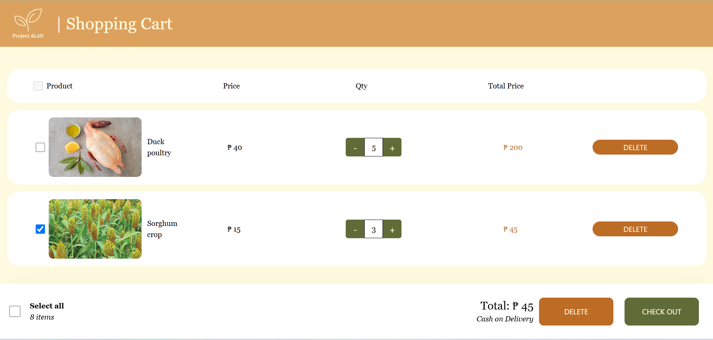
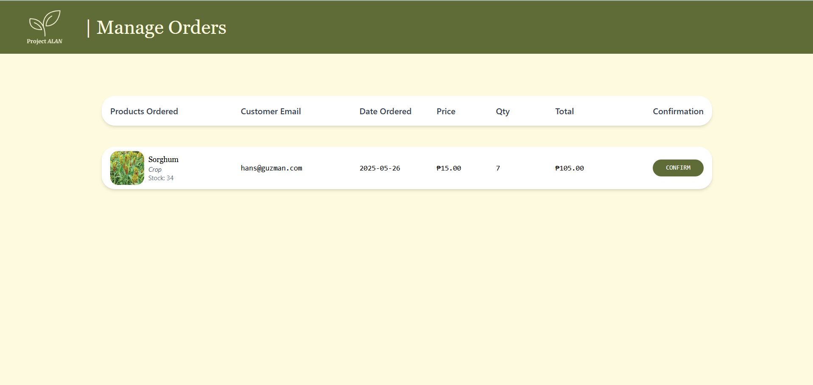

# PROJECT ALAN

**Section**: C-4L  
**Team Members**:
- Joy Christine Laura Guevarra  
- Hans Dean Guzman  
- Alan Benedict Vender  

---

## Project Features

### 🔐 Authentication

#### Landing Page
This is the first page. It contains **Login** and **Sign Up** buttons for authentication.

#### Login Page
- User is asked to log in with **email** and **password**.
- The account must exist in the database; otherwise, the login will fail.
- Includes a **Sign Up** text button to redirect to the Sign Up page.
  

#### Sign Up Page
- User is asked to register with their **first name**, **last name**, **email**, and **password**.
- The password will be **encrypted** in the database.
  

---

## Customer Side

### Product Listing
- Displays a list of products from the database.
- Entries can be **sorted** by name, type, price, or quantity using a drop-down menu.
- Sorting order can be toggled **ascending/descending** with an arrow.
- Users can **add products to the cart**.
- The **cart button** in the header shows the current cart and allows quantity adjustments.
- A **hamburger menu** leads to transaction history.
- Includes a **logout** button.
- Clicking the **logo** in the header navigates back to the product listings.
  

### Shopping Cart
- Displays a list of the user’s transactions in the cart.
- Users can **increase/decrease** the quantity or **cancel** transactions.
- Users may **select individual** items or use the **select all** checkbox to checkout.
- Clicking the **logo** in the header navigates back to the product listings.

### Manage Orders
- Shows both **pending** and **completed** transactions.
- Pending transactions can still be **canceled**.
- Clicking the **logo** in the header navigates back to the product listings.

---

## Admin Side

### Dashboard
- Admin is directed here after logging in.
- Contains **navigation buttons** for admin pages.
- The header includes a **Sign Out** button.

### Product Listing
- Shows the product list from the database.
- Can be **sorted** by name, type, price, or quantity.
- Sorting order toggled with an arrow.
- Admin can **edit stock and price**.
- Clicking the **logo** in the header navigates to the dashboard.

### Order Fulfillment
- Displays **pending transactions** from the database.
- Admin can **confirm** transactions, marking them as completed.
- Clicking the **logo** in the header navigates to the dashboard.

### Manage Users
- Shows a list of customers from the database.
- Each customer is listed with their **total spent**.
- Clicking the **logo** in the header navigates to the dashboard.

### Sales Reports
- Displays **sales data** by product or completed transactions.
- Can be filtered by **last week**, **month**, or **year**.
- Clicking the **logo** in the header navigates to the dashboard.

---

## Usage Guidelines

1. Ensure you have a `.env` file with your own **MongoDB `authKey`**.
2. Run `npm i` inside both the `backend` and `frontend` directories (❗️**not in root**).

---

## How to Run

1. Navigate to the `backend` directory on the terminal and run:
   - node index.js
2. Navigate to the `frontend` directory on the terminal and run:
   - npm run dev
3. Open your browser and go to:
   - http://localhost:5173

Alternatively you can access: https://project-alan-bank.vercel.app/
